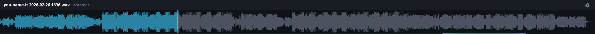

# WavePlayer

A Linux audio player with a SoundCloud-style waveform display, built for music and audio production workflows.



## Features

- **SoundCloud-style waveform** — 2048-bucket waveform with peak, RMS, and reflection
- **Energy color mode** — DJ-style frequency coloring (bass/mid/high)
- **Region loop** — Shift+drag to set a loop region, Escape to clear
- **MPRIS2** — KDE taskbar control, media keys, artwork, live seekbar
- **Send to DAW** — Open the current file in Audacity, Ardour, REAPER, Bitwig, and more (Ctrl+E)
- **Desktop notifications** — On/off toggle with configurable minimum track duration
- **File info window** — Album art, tags, codec, sample rate, bit depth, bitrate, file size
- **Auto-advance** — Plays next file in directory when track ends
- **Loop track** — Loops the current file
- **Single instance** — Opening a second instance passes the file to the running one
- **Persistent settings** — Volume, window height, colors, and all toggles saved to config

## Controls

| Input | Action |
|-------|--------|
| Space | Play / Pause |
| Left / Right | Seek ±N seconds |
| Up / Down | Previous / Next file in directory |
| Left-click waveform | Seek to position |
| Left-click drag | Scrub |
| Shift + left-click drag | Set loop region |
| Escape | Clear loop region |
| Right-click waveform | Open file dialog |
| Ctrl+E | Toggle send-to panel |

## Installation

### Build from source

```bash
git clone https://github.com/MrDorianJames/waveplayer
cd waveplayer
cargo build --release
./target/release/waveplayer /path/to/file.wav
```

### Desktop integration

```bash
cp waveplayer.desktop ~/.local/share/applications/
update-desktop-database ~/.local/share/applications/
```

Edit `waveplayer.desktop` to point `Exec=` at your binary path if needed.

## Supported formats

MP3, WAV, FLAC, OGG, AAC, M4A, AIFF

## Configuration

Config file: `~/.config/waveplayer/config.toml`

```toml
volume=0.8
full_width=false
energy_colors=true
loop_track=false
auto_advance=false
seek_secs=5
notifications_enabled=true
notification_min_duration=60
window_height=110
send_to_apps=Reaper:reaper %f,MyApp:/opt/myapp/app --import %f
accent_r=1
accent_g=0.42
accent_b=0
```

### Custom send-to apps

Format: `Name:command %f` where `%f` is replaced with the file path.
If `%f` is omitted the file is appended as the last argument.

```toml
send_to_apps=Reaper:reaper %f,Bitwig:bitwig-studio %f,MyTool:/usr/local/bin/mytool --open %f
```

## Dependencies

- [iced](https://github.com/iced-rs/iced) 0.13
- [symphonia](https://github.com/pdeljanov/Symphonia) — audio decoding and seeking
- [rodio](https://github.com/RustAudio/rodio) — audio output
- [mpris-server](https://github.com/SeaDve/mpris-server) — MPRIS2 D-Bus integration
- [lofty](https://github.com/Serial-ATA/lofty-rs) — tag reading
- [notify-rust](https://github.com/hoodie/notify-rust) — desktop notifications
- [rfd](https://github.com/PolyMeilex/rfd) — file dialog

## License

MIT
